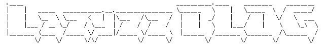
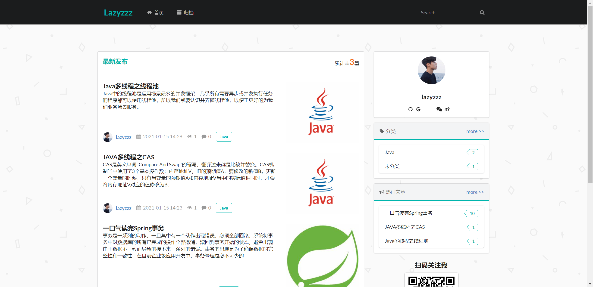
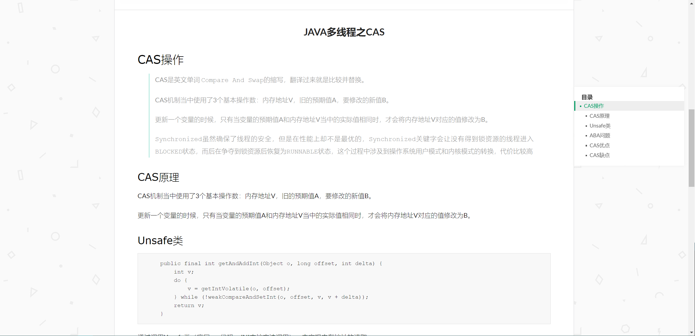
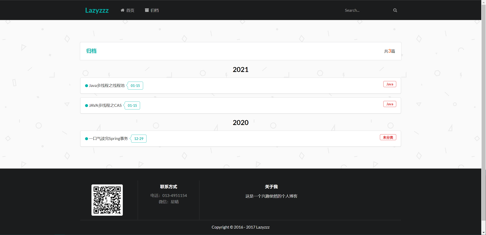
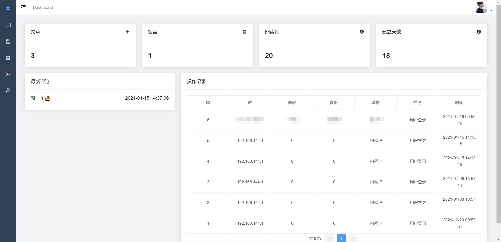
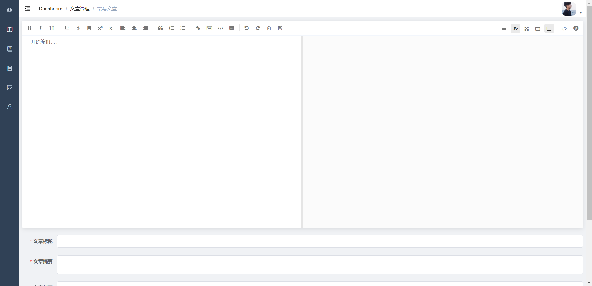
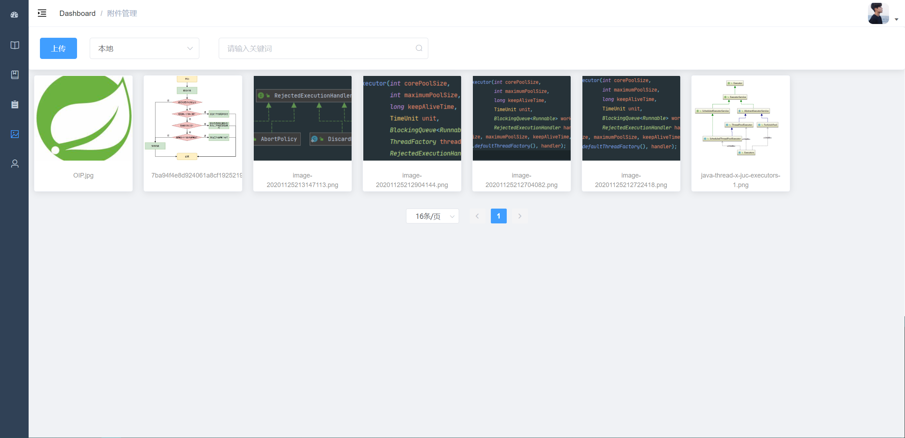
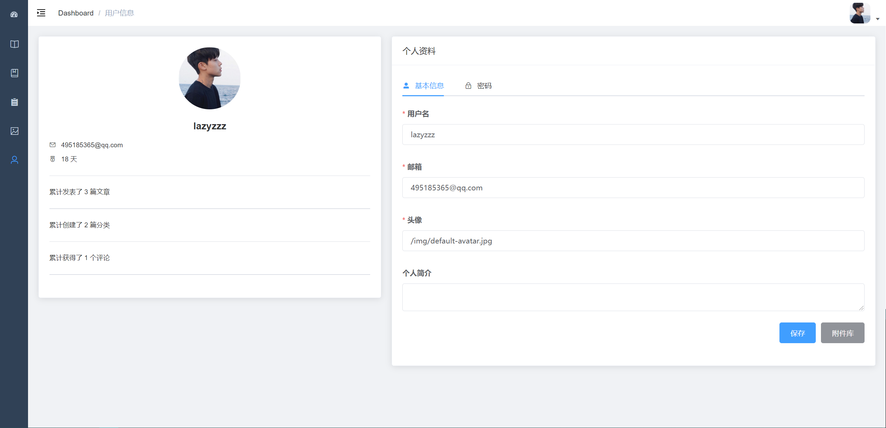

<center>



</center>

> 一个适合新手学习，参考和使用的开源博客

<p align="center">
<a href="https://github.com/NyannCat/lazyzzz-blog"></a>
<a href="https://github.com/NyannCat/lazyzzz-blog/stargazers"></a>

</p>

## 简介
Lazyzzz 是我参加ACM比赛时的昵称，寓意用最高效，简洁的方法去编码。
本着学习互联网最新技术的目的，使用`SpringBoot` + `Vue`撰写了这个项目。

- [项目演示](https://www.lazyzzz.club/)
- [API文档](doc/api-doc.md)

## 特色
- 基础的博客功能（文章，分类，评论）
- 集成了简单的图床功能（本地、七牛云）
- 文章编辑支持`markdown`，代码高亮和自动目录生成
- 采用`Docker-compose部署`，集成`Github Action`进行CI/CD, 简单一键部署

## 快速开始
### Docker-compose
1. 下载docker-compose & SQL script (经测试，没有代理的情况下，阿里云可能无法下载。请自行拷贝conf目录下的全部文件到主机)
```shell
curl https://raw.githubusercontent.com/NyannCat/lazyzzz-blog/master/config/docker-compose.yml
curl https://raw.githubusercontent.com/NyannCat/lazyzzz-blog/master/config/script.sql
```

2. 创建目录，复制script.sql以初始化mysql
```shell
mkdir -p mysql/init
cp script.sql mysql/init/script.sql
```

3. 修改docker-compose.yml， 其中最重要的是要修改`MYSQL_ROOT_PASSWORD`的默认值
```yaml
environment:
version: '3'
services:
  mysql:
    image: mysql:8
    container_name: blog-mysql
    restart: always
    volumes:
      - ./mysql/data:/var/lib/mysql
      - ./mysql/config/my.cnf:/etc/my.cnf
      - ./mysql/init:/docker-entrypoint-initdb.d/
    environment:
      - MYSQL_ROOT_PASSWORD=123456 #请务必更改默认密码
      - MYSQL_DATABASE=blog
    ports:
      - "3306:3306"

  web:
    image: lazyzzz/lazyzzz-blog
    container_name: blog-web
    restart: always
    volumes:
      - ./lazyzzz:/root/lazyzzz
    environment:
      - MYSQL_ROOT_PASSWORD=123456 #务必保证与上文的MYSQL密码一致
      - JAVA_OPTS="-Xms256m -Xmx256m" #虚拟机参数，按需更改
    ports:
      - "8080:8080"
    depends_on:
      - mysql

```

4. 执行Docker-compose脚本
```shell
docker-compose up -d
```

### Jar包
请参考`application.yml`自行配置Mysql后运行jar包

## 技术栈
### 后端
- JDK: 11
- Spring Boot 2.4.1
- ORM: Mybatis-Plus & Mybatis-Plus Code Generator
- 数据库: MySQL
- 安全校验: JWT
- 接口限流: Guava RateLimiter
- 二维码校验: kaptcha

### 前端
基于Vue Admin Template & Element UI 修改

## 博客截图
### 主页

### 博客内容

### 归档

### 控制台

### 文章编辑

### 附件管理

### 用户中心


## 鸣谢
- 感谢带我入门博客开发的课程，部分主页模板由其修改而来 [SpringBoot开发一个小而美的个人博客](https://www.bilibili.com/video/BV1nE411r7TF?from=search&seid=2627904292093709093)

- 感谢 [Halo](https://github.com/halo-dev/halo) 以及 [Vue-Admin-Template](https://github.com/PanJiaChen/vue-admin-template) 
杰出的开源贡献，为本项目提供了许多思路和启发
